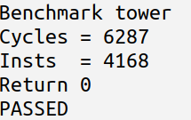
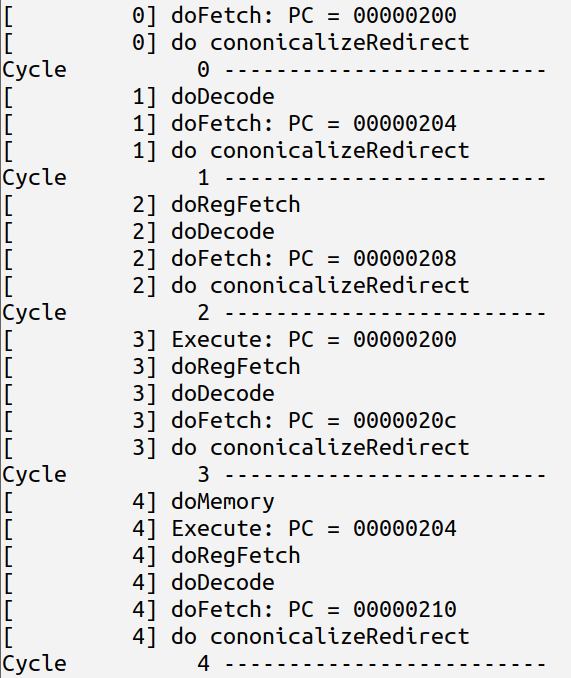
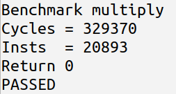
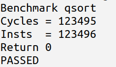
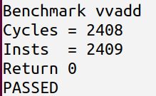

# Lab1

## 多选器

1-bit的多选器结构如下：


实验中采用多个并行的1-bit多选器实现多态的n-bit的多选器；

注意：在function中，输入参数带有numeric type n可以实现多态；

````
function Bit#(n) multiplexer_n(Bit#(n) a, Bit#(n) b, Bit#(1) sel);
    Bit#(n) resu = 0;
    for(Integer i=0; i<valueOf(n); i=i+1) begin
        resu[i] = multiplexer1(a[i], b[i], sel);
    end
    return resu;
endfunction
````

仿真结果：


## 加法器

本实验中实现的加法器主要分为两种，第一种为ripple carry加法器：


其接口为：

 ````
 interface Adder8;
     method ActionValue#(Bit#(9)) calc(Bit#(8) a, Bit#(8) b, Bit#(1) c_in);
 endinterface
 ````

实现核心程序（add4为4个全加器级联函数）：

````
module mkRCAdder(Adder8);
    method ActionValue#(Bit#(9)) calc(Bit#(8) a, Bit#(8) b, Bit#(1) c_in);
        Bit#(5) low = add4(a[3:0], b[3:0], c_in);
        Bit#(5) high = add4(a[7:4], b[7:4], low[4]);
        return {high, low[3:0]};
    endmethod
endmodule
````

它的结构简单，实现容易，但通过级联全加器的方式实现当bit数高时逻辑延时随之比例升高；

第二种为carry select加法器：


对高四位的加法同时计算有\无进位的结果，再通过低四位的结果进行选择，逻辑上延时减半但面积增加了，核心代码如下：

````
module mkCSAdder(Adder8);
    method ActionValue#(Bit#(9)) calc(Bit#(8) a, Bit#(8) b, Bit#(1) c_in);
        Bit#(5) low = add4(a[3:0], b[3:0], c_in);
        Bit#(5) high0 = add4(a[7:4], b[7:4], 1'b0);
        Bit#(5) high1 = add4(a[7:4], b[7:4], 1'b1);
        let high = multiplexer_n(high0, high1, low[4]);
        return {high, low[3:0]};
    endmethod
endmodule
````

附：bsv中随机数的生成

````
module mkTbRCAdder();
    Randomize#(Bit#(8)) a_random <- mkGenericRandomizer; // 例化随机数生成模块
    Reg#(int) cnt <- mkReg(0);
    rule test;
        cnt <= cnt+1;
        if(cnt == 0) begin
            a_random.cntrl.init; // 需要在第一个时钟周期初始化
        end
        else begin
            let a <- a_random.next; // 用<-来获取ActionValue方法next
        end
    endrule
endmodule
````

仿真结果：


## 桶形移位器

桶形移位器包含多个串联的2的幂次方的移位器，通过多选器来决定是否使用某个移位器，来达到任意数的移位功能，本实验以右移为例，首先实现右移2次幂的电路：

````
function Bit#(32) shiftRightPow2(Bit#(32) unshifted, Integer power, Bit#(1) en);
    Integer i = 2**power;
    Bit#(32) shifted = 0;
    Bit#(32) resu = 0;
    for(Integer j=0; j<32-i; j=j+1) begin
        shifted[j] = unshifted[j+i];
    end
    resu = (en==1) ? shifted : unshifted;
    return resu;
endfunction
````

再用多选器进行串联：

````
function Bit#(32) barrelShiftRight(Bit#(32) in, Bit#(5) shiftBy);
    Bit#(32) resu = in;
    for(Integer i=0; i<5; i=i+1) begin
        resu = unpack(shiftRightPow2(resu, i, shiftBy[i]));
    end
    return resu;
endfunction
````

仿真结果：


# Lab2

本实验主要介绍了如何将逻辑电路转变为elastic和inelastic的pipeline电路

以fft电路为例，其逻辑电路核心如下：

````
for (StageIdx stage = 0; stage < 3; stage = stage + 1) begin
	stage_data[stage + 1] = stage_f(stage, stage_data[stage]);
end
````

1、转变为inelastic pipeline电路：采用寄存器存储每一个流水线级的中间数据，流水线需要严格按照时序输入，不然会造成数据错误;

仿真结果：


2、转变为elastic pipeline电路：采用fifo衔接前后流水线级的中间数据，fifo能保持数据并有安全的接口，对输入输出端有很大灵活性

````
module mkFftElastic(Fft);
    FIFOF#(Vector#(FftPoints, ComplexData)) inFifo <- mkFIFOF;
    FIFOF#(Vector#(FftPoints, ComplexData)) outFifo <- mkFIFOF;
    FIFO#(Vector#(FftPoints, ComplexData)) fifoS1 <- mkSizedFIFO(3);
    FIFO#(Vector#(FftPoints, ComplexData)) fifoS2 <- mkSizedFIFO(3);

    rule fftS1;
        let s1_ret = stage_f(0, inFifo.first);
        fifoS1.enq(s1_ret);
        inFifo.deq;
    endrule

    rule fftS2;
        let s2_ret = stage_f(1, fifoS1.first);
        fifoS2.enq(s2_ret);
        fifoS1.deq;
    endrule

    rule fftS3;
        let s3_ret = stage_f(2, fifoS2.first);
        outFifo.enq(s3_ret);
        fifoS2.deq;
    endrule

    method Action enq(Vector#(FftPoints, ComplexData) in);
        inFifo.enq(in);
    endmethod

    method ActionValue#(Vector#(FftPoints, ComplexData)) deq;
        outFifo.deq;
        return outFifo.first;
    endmethod
endmodule
````

仿真结果：


# Lab3

实验三的主要内容为采用folded的方式来设计移位累加原理的乘法器：


核心代码如下，需要注意的地方：

1、interface的guard

2、数据位宽

3、移位累加原理的乘法器仅适用于正数乘法

4、在interface中，可以在“#”后定义参数实现多态

````
interface Multiplier#(numeric type n);
    method Bool start_ready();
    method Action start(Bit#(n) a, Bit#(n) b);
    method Bool result_ready();
    method ActionValue#(Bit#(TAdd#(n,n))) result();
endinterface

module mkFoldedMultiplier(Multiplier#(n)) provisos(Add#(1, a__, n));
    Reg#(Bit#(TAdd#(TLog#(n),1))) cnt <- mkReg(fromInteger(valueOf(n)+1));
    Reg#(Bit#(n)) a <- mkRegU();
    Reg#(Bit#(n)) b <- mkRegU();
    Reg#(Bit#(TAdd#(n,1))) part_sum <- mkReg(0);
    Reg#(Bit#(n)) resu_lower <- mkRegU();

    rule step_mul if (cnt < fromInteger(valueOf(n)));
        cnt <= cnt + 1;
        Bit#(n) part_sum_upper = part_sum[valueOf(n):1];
        Bit#(TAdd#(n,1)) temp_sum = add_unsigned(part_sum_upper, b[0]==1 ? a : 0);
        part_sum <= temp_sum;
        b <= b >> 1;
        resu_lower <= {temp_sum[0], resu_lower[valueOf(n)-1:1]};
    endrule

    method Bool start_ready();
        return (cnt == fromInteger(valueOf(n)+1));
    endmethod    

    method Action start(Bit#(n) a_in, Bit#(n) b_in) if (cnt == fromInteger(valueOf(n)+1));
        cnt <= 0;
        a <= a_in;
        b <= b_in;
        part_sum <= 0;
    endmethod

    method Bool result_ready() ;
        return True;
    endmethod

    method ActionValue#(Bit#(TAdd#(n,n))) result() if (cnt == fromInteger(valueOf(n)));
        cnt <= cnt+1;
        Bit#(n) resu_upper = part_sum[valueOf(n):1];
        Bit#(TAdd#(n,n)) resu = {resu_upper, resu_lower};
        return resu;
    endmethod
endmodule
````

此外实验还给出了Booth原理的乘法器可用于有符号数乘法，在此不一一例举了。

编译warning：


仿真结果：


# Lab4

本实验实现了n长度的四种FIFO：Conflict FIFO、Bypass FIFO、Pipeline FIFO、Conflict Free FIFO，其中主要用到了Ehr寄存器实现了rule之间优先级处理：


1、Confict FIFO：rule之间涉及到double write冲突，因此在编译时有warning：


仿真结果：


2、Bypass FIFO：rule enq中采用Ehr的优先级0操作输入输出指针、empty、full信号，在rule dep中采用优先级1操作这些变量。

编译仿真结果：


3、Pipeline FIFO：rule deq中采用Ehr的优先级0操作输入输出指针、empty、full信号，在rule enq中采用优先级1操作这些变量。

编译仿真结果：


4、Conflict Free FIFO：rule enq和deq中都只采用empty、full优先级0，并用优先级0采集输入输出的信号和数据，在rule canonicalize中，首先将输入输出信号置False，然后采用优先级1操作empty、full、enq和deq指针。

编译仿真结果：


# Minist FIFO 设计与思考

接口如下：

````
interface Fifo#(type t);
    method Bool notFull;
    method Action enq(t x);
    method Bool notEmpty;
    method Action deq;
    method t first;
endinterface
````

## 1 Pipeline FIFO

长度为1

编译与功能、调度仿真：


## 2 Bypass FIFO

长度为1

编译与功能、调度仿真：


## 3 Conflict Free FIFO

长度为2

编译与功能、调度仿真：


## 4 总结

1、并发关系

（1）Pipeline FIFO：满时并发


（2）Bypass FIFO：空时并发


（3）Conflict Free FIFO：不空不满时并发


2、关键路径分析：

（1）Pipeline FIFO：在并发时为满，在一个时钟周期内，先完成deq操作将旧的数据取出，记为A；再完成enq操作将新的数据读入，记为B，则这个逻辑消耗的时间为t(A)+t(B)。但n个满的Pipeline FIFO级联时，若进行数据依次传输，由于前一个FIFO的deq操作会被后一个FIFO的deq操作阻塞，因此首先由第n个FIFO执行deq，再由第n-1个FIFO执行deq，如此直到第1个FIFO，这个逻辑执行时间为n*[t(A)+t(B)]

（2）Bypass FIFO：在并发时为空，在一个时钟周期内，先完成enq操作将新的数据读入，记为A；再完成deq操作将旧的数据取出，记为B，则这个逻辑消耗的时间为t(A)+t(B)。但n个空的Bypass FIFO级联时，若进行数据依次传输，由于后一个FIFO的enq操作会被前一个FIFO的enq操作阻塞，因此首先由第1个FIFO执行enq，再由第2个FIFO执行enq，如此直到第n个FIFO，这个逻辑执行时间为n*[t(A)+t(B)]

（3）Conflict Free FIFO：不空不满时并发，在一个时钟周期内同时完成enq和deq的操作，逻辑消耗时间为max(t(A), t(B))，即使有n个可并发的Conflict Free FIFO级联，前后FIFO的enq和deq操作没有依赖关系，因此逻辑消耗时间仍然为max(t(A), t(B))


# Lab5

Exercise 0:

```
make build.bluesim VPROC=ONECYCLE 
```


```
./run_asm.sh
```


exercise 1:

```
./run_bmarks.sh
```


TWO_STAGE BenchMark:


TWO_STAGE with Branch Target Buffer(BTB) BenchMark


**Harzards:**

**1、structural harzard**：results from reads cannot be used in the same cycle as the reads are performed ( come from delayed mem); 

solve: extra pipeline stage

**2、control harzard**：For branch instructions, the next instruction is not always known ( come from different stage between fetch and execution); 

solve: ***epoch*** 

**3、data harzard**：: register values got in decode stage  may be stale with different stage between decode and execute; 

solve: Bypass Register File; ***Scoreboard*** ( A data structure to keep  track of the instructions in the pipeline  beyond the Fetch stage )

(not in Lab5, in Lab6)

**solve**: stall, bypass, speculate ( if incorrect then kill )


**branch target buffer** ( BTB )：

predicts the location of the next instruction to fetch based on the current value of the program counter


**predict accuracy in lab5 two stage：**

1-(cycle-inst)/inst = (2*inst-cycle)/inst = 2-CPI

# Lab 6

## SixStage:

**1、six stage bench mark：**



（1）mispredict：在execute执行后可得知是否mispredict，若发生mispredict，execute stage之前的n个stage都需要kill，采用epoch寄存器来进行同步，lab6中一次mispredict造成3个dead cycle

（2）data harzard：在reg fetch阶段可以得知，采用soreboard判断（reg fetch写入，write back取出），由于其stall造成的dead cycle取决于reg fetch到write back之间的周期数，在lab6为3个cycle

**2、six stage bht bench mark：**


**Branch History Table** ( BHT ) : 

在decode阶段，若发现Br或J指令，则采用BHT进行一次predict，并添加了一个epoch寄存器用于同步。

**3、在都是用CF fifo时rule的调度顺序：**


**前10个时钟周期rule的调度顺序：**


**影响调度顺序的因素：**

（1）register file：rd<wr  导致  doRegFetch<doWriteBack

（2）bht：ppcDP<update 导致 deDecode<doExecute

（3）btb：predPc<update 导致 doFetch<cononicalizeRedirect

（4）decEpoch：rd<wr 导致 {doFetch, doDecode}<cononicalizeRedirect

（5）exeEpoch: rd<wr 导致  {doFetch, doDecode, doRegFetch, doExecute}<cononicalizeRedirect

（6）pcReg[0].wr < pcReg[1].wr  导致 doFetch<cononicalizeRedirect

（7）exeRedirect[0].wr < exeRedirect[1].wr 导致 doExecute<cononicalizeRedirect

（8）decRedirect[0].wr < decRedirect[1].wr 导致 doDecode<cononicalizeRedirect

（9）cycle: rd<wr 导致 cycleCounter > 其他rule

（10）csrf: rd<wr 导致 doRegFetch<doWriteBack


**4、在都改用长度为1的Pipeline FIFO后rule的调度顺序：**


benchmark：


前20个时钟周期rule的调度顺序：


**影响调度顺序的因素：**

除了在如上CF fifo中的因素以外，还有：

由于pipeline fifo中 {notEmpty, first, deq} < {notFull, enq} ，导致：

doWriteBack < doMemory < doExecute < doRegFetch < doDecode < doFetch < cononicalizeRedirect < cycleCounter

产生conflict，使得bsv调度器无法在一个时钟周期内完成所有rule的调度

**BSV 规则调度两条原则：**

1、在一个时钟周期内，一条规则要么被激活，要么在编译时产生警告。当规则之间冲突时，bsv编译器将随机决定优先级。若规定了，则采用调度属性中规定的优先级；

2、在一个时钟周期内，一条规则最多被执行一次；


**5、改进的Pipeline FIFO后rule的调度顺序：**

改进内容：

（1）采用Bypass Register File

（2）采用Bypass Branch History Table ( BHT )

（3）采用Bypass Csr File

前10个时钟周期调度顺序：




**6、在都改用长度为1的Bypass FIFO后rule的调度顺序：**


分析：

（1）在Bypass Fifo下，流水线结构失效，变成了组合逻辑

（2）doFetch和doWriteBack阶段和其他分开，是因为访存有1个时钟周期的延迟（FPGA Block Ram）

**2、six stage bht 将misprediction改为bypass：**

benchmark：在IPC上相比于six stage bht 有所改进，但采用了bypass结构使得关键路径更长了


## six stage bonus


（1）在 reg fetch 阶段可以对 JALR 指令进行 pc redirect

（2）在decode阶段采用 return address stack (RAS) ，在  JALR 跳转到函数体时将 pc 压栈，在跳回时 出栈 并进行 pc redirect

# Lab7

## 1 Without Cache

**benchmark:**



## 2 With Cache

**benchmark:**


**cahe结构：**


**Cache工作逻辑：**

```
根据addr中的index得到cache line
将addr中的tag和cache line中的tag比对
If 相同（Hit）：
​	If 指令为Load：
​		根据addr中的offset得到cache line中的数据
​		将该数据发送给处理器
​	Else（指令为store）：
Else（Miss）：
​	If cache line的dirty和valid有效：
​		将cache line写回ddr
​	向ddr读取数据地址addr所在的数据块data
​	If 指令为Load：
​		将data存入cache line
​	Else（指令为store）：
​		根据addr中的offset修改data
将修改后的data存入cache line
```


# Lab8

1、normal bench mark


2、exception test



3、permission test


