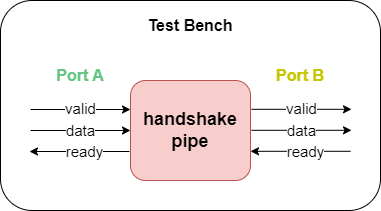
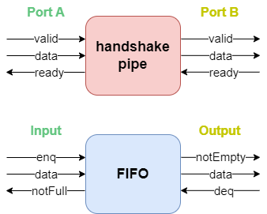
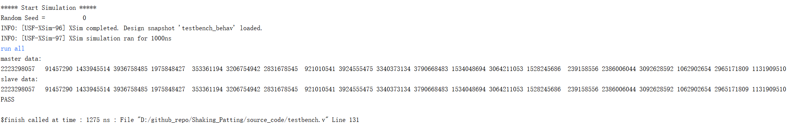

# 握手打拍

## 1 程序构成

本握手打拍程序主要由以下几个主体构成，见source_code目录：

1、handshake_pipe：AXIS Master和Slave接口之间的模块，用于打拍缓存

2、Test bench：自动化测试程序

## 2 硬件结构

## 3 握手打拍分析

handshake pipe模块的功能是给上下游握手信号打拍，以及数据缓存，本质上起到着FIFO缓冲的作用，他们之间相互的对应关系可由下图表示。

对于不同的打拍方式，实际上对应于不同的FIFO

（1）ready打拍：Bypass FIFO

（2）valid打拍：Pipeline FIFO

（3）同时打拍：Conflict Free FIFO

（4）不打拍：Wire

仿真结果如下图所示：

